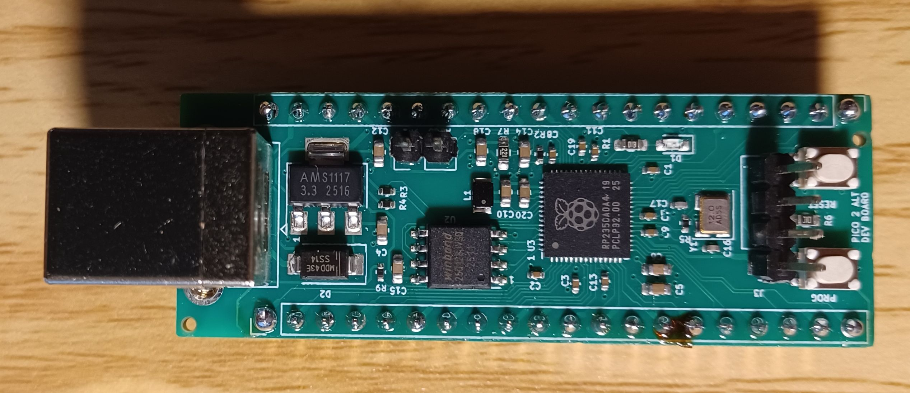
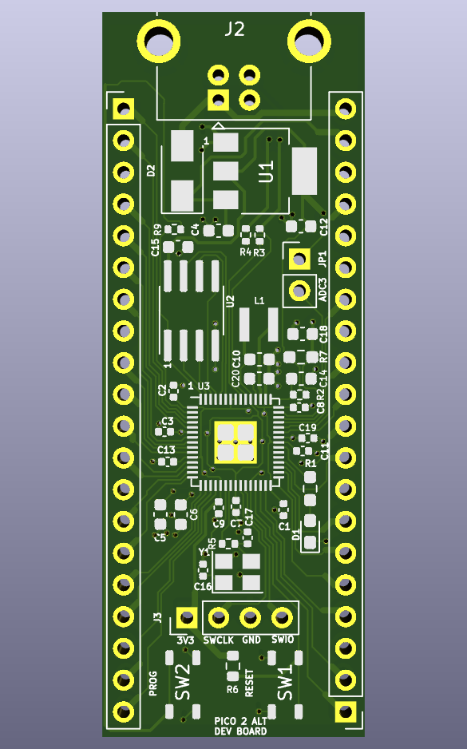

# Pico Alt 2

This is a simplified Pi Pico board for the new RP2350.  This has been fabricated by JLCPCB and a photograph of the result is below.  It is tested to download sketches. I customized it to add more flash (16 MB), a linear regulator (AMS1117-3.3), and to be easier to modify if needed.

