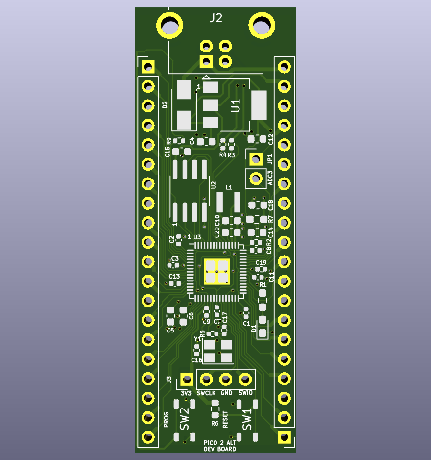

# Pico Alt 2

This is a simplified Pi Pico board for the new RP2350.  When JLCPCB carries the RP2350, I'll get it fabricated  I customized it to add more flash, a linear regulator, and to be easier to modify if needed.

